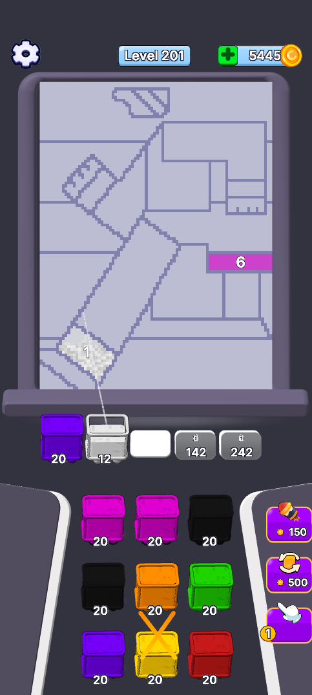

# Sand Jam Clone — Unity gameplay prototype

Project Unity độc lập, phục dựng một màn Sand Jam theo video và dữ liệu do người dùng cung cấp.



## Mở project

1. Clone repository này và thêm **thư mục repository** vào Unity Hub.
2. Dùng **Unity 2022.3.62f3**.
3. Mở `Assets/Scenes/SandJamVideo201.unity`, nhấn Play.
4. Từ Home, bấm **PLAY** để chơi Level 201 theo video.

Màn cũ Level 147 vẫn ở `Assets/Scenes/SandJamVideoUI.unity`. Màn đóng băng ở `Assets/Scenes/SandJamFreezeTest.unity`: đưa hộp khác lên hàng bắn để giảm lớp băng. Xem [Level 201](Documentation/VIDEO_201_VI.md) và [cơ chế băng](Documentation/FREEZE_MECHANIC_VI.md).

Không cần project AssetRipper bên ngoài để chạy scene. Các asset cần thiết đã được sao chép vào project; dữ liệu trích xuất đầy đủ và video tham chiếu không nằm trong repository.

## Scene chung và Burst

`SandJamGame.unity` nạp prefab của Level 1–3 qua catalog. Sáu scene cũ/trùng đã được bỏ; các scene test 147, 201, dây nối và băng vẫn giữ. Mô phỏng cát dùng Burst Jobs, xử lý độc lập theo vùng. Xem [kết quả tối ưu và gộp scene](Documentation/BURST_SCENE_MERGE_VI.md).

## Test nhiều level

Mở `Assets/Scenes/SandJamGame.unity`: Home có LV 1–3, thắng rồi Next để sang màn tiếp theo. Catalog ở `Assets/Resources/LevelPack/Catalog.asset`; tiến độ màn đã thắng được lưu bằng PlayerPrefs. [Phân tích 556 JSON và các manager](Documentation/LEVEL_DATA_MANAGERS_VI.md). [Danh mục dữ liệu](Documentation/LEVEL_DATA_INVENTORY.csv).

Build bằng menu **Sand Jam > Levels > Build catalog levels**, hoặc editor method `SandJamTest.Editor.BuildVideoScene.CreateLevelPackAndBuild`.

## Điều khiển

**Test cặp hộp nối nhau:** mở `Assets/Scenes/SandJamChainTest.unity`, Play → PLAY, rồi chọn hộp đen hoặc vàng. [Cơ chế và dữ liệu cặp nối](Documentation/CHAIN_MECHANIC_VI.md). [Phân chia scripts](Documentation/SCRIPT_STRUCTURE_V2_VI.md).

- Chuột hoặc **1 / 2 / 3**: chọn nhân vật đầu hàng.
- **R**: chơi lại; **Space**: tạm dừng gameplay; **Esc**: về Home.
- **F1–F5**: xem nhanh Loading, Home, Gameplay, chúc mừng và bảng thưởng. F4/F5 là chế độ xem giao diện.
- **Next** về Home để thử lại cùng level; chưa có tiến trình nhiều level.

## Đã có

- Level 201 dùng board và hàng chờ từ JSON gốc, hai cặp nối dọc, hai ô khóa 150/250; đã qua replay thắng 24 lượt.
- Hộp có khung 3D và khối cát riêng: cát giảm dần, cạn thì rỗng, giữ màu viền và đi ra khỏi màn.
- Màn test đóng băng với bộ đếm, hiệu ứng tan và kiểm tra tương tác booster/cặp nối.

- Năm màn: Loading → Home → Gameplay → chúc mừng → kết quả.
- Màn khuôn mặt từ `112x84_New_PopArt_13`: 18 vùng, ba hàng nhân vật, **đúng 5 ô chờ**.
- Ô thứ năm mở sau khi dùng 300 đơn vị cát; vùng chưa mở không hiện màu và số lượng.
- Cát theo grid texture, một cell tương ứng một pixel, hiển thị bằng SpriteRenderer.
- Model 41 khớp với animation Walk/Sit lấy từ dữ liệu gốc.
- Camera phối cảnh cho sân chơi, camera trực giao riêng cho UI; hộp nghiêng, khung và ô chờ có độ dày.
- Shader `SandJamTest/SandToonDepth`: sáng tối theo normal, texture cát, highlight và viền. Bóng tiếp xúc dùng decal mềm, không dùng shadow map thời gian thực.

Ba booster đã hoạt động: hé lộ vùng, đổi hai hàng đầu và chọn hộp vượt lượt theo màu đang mở. Dùng miễn phí trong bản thử; xem [hướng dẫn hỗ trợ](Documentation/BOOSTERS_VI.md).

Settings, Shop, Gallery, Join, x2 và mua tiền/tim hiện **chỉ có UI**. Số dư, phần thưởng và số level là giá trị tham chiếu. Chưa có quảng cáo, thanh toán, lưu tiến trình hoặc cơ chế đặc biệt đầy đủ.

## Build Windows

Có thể dùng Build Settings của Unity, hoặc gọi editor với:

```text
-batchmode -quit -projectPath <repo> -executeMethod SandJamTest.Editor.BuildVideoScene.CreateVideo201AndBuild -logFile <log-path>
```

Lệnh tạo lại scene rồi xuất `BuildVideoUI/SandJam-VideoUI.exe`. Thư mục build không được commit. Menu `Sand Jam > Video UI > Create video screens` tạo lại scene trong Editor; lưu thay đổi scene đang mở trước khi dùng.

## Kiểm tra

Bản chạy có kiểm tra tự động:

```text
SandJam-VideoUI.exe --video-smoke <output-folder> -logFile <log-path>
```

Kiểm tra chụp từng màn, camera/shader, đầy đủ material cho model, biến đổi khớp chân khi Walk, rót cát, mở ô chờ thứ năm, replay 24 lượt thắng đủ 18 vùng và chơi lại. Không chạy với `-nographics` vì cần chụp ảnh.

Kết quả bàn giao được tóm tắt ở [DEPTH_RENDERING_VI.md](Documentation/VideoUI/DEPTH_RENDERING_VI.md). Chưa kiểm tra hiệu năng trên thiết bị Android/iOS thật.

## Cấu trúc

- `Assets/Scripts/Runtime`: dữ liệu, gameplay, mô phỏng cát, nhân vật, UI.
- `Assets/Editor/ReferenceUI/BuildVideoScene*.cs`: dựng scene, các màn UI, rig và hình học 3D.
- `Assets/Resources/SandToonDepth.shader`: shader toon mới.
- `Assets/Resources/VideoUI`, `CharacterAnimation`, `Original`: bản sao asset phục vụ prototype.
- `Assets/Generated/VideoUI`: mesh, material, controller và dữ liệu màn sinh riêng.
- `Documentation/VideoUI`: phân tích, giới hạn và nguồn asset.

Các scene và tài liệu thử trước được giữ để tham khảo; hướng dẫn hiện tại là README này. Đây là prototype phục dựng, không phải mã nguồn/logic hoàn chỉnh của game gốc. Shader mới là bản tương thích tự viết, không khẳng định khôi phục nguyên bản shader của APK.
